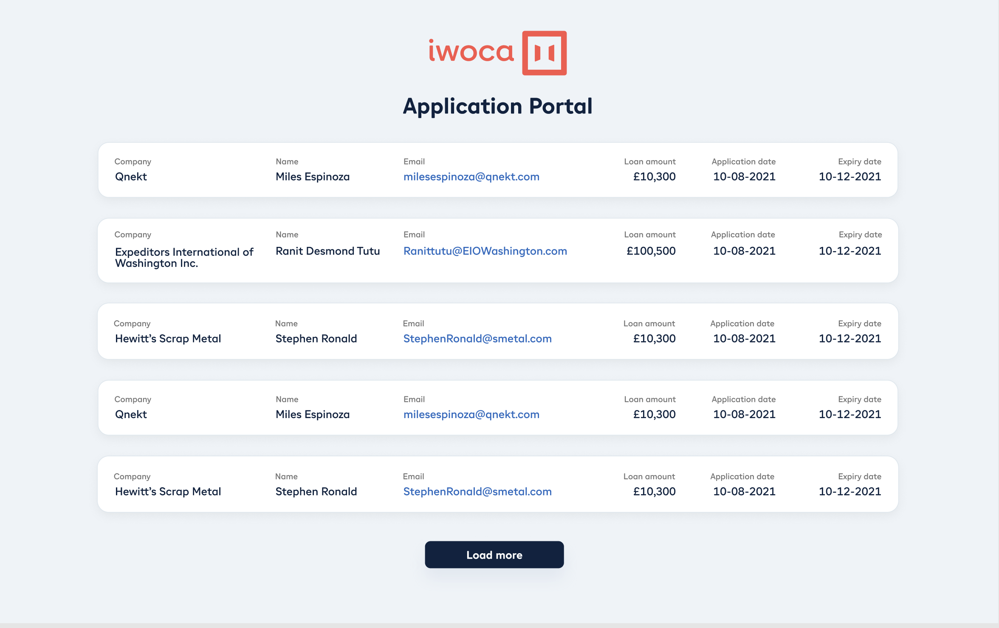

## Implementation Comments

### Demo

### Overview
This implementation follows the requirements from the README, integrating with the API endpoint, implementing pagination, and matching the Figma design specifications.

### Key Features Implemented

### API Integration
- Replaced hardcoded fixture with API calls to `http://localhost:3001/api/applications`
- Implemented pagination using `_page` and `_limit` query parameters
- Parsed `Link` header to determine if more pages are available
- Added proper error handling for API failures

### UI/UX
- Matched Figma design specifications for:
- Added loading spinner with smooth animation
- Implemented responsive design for mobile, tablet, and desktop
- Ensured proper text wrapping for long content without distorting column widths

### Code Organization
- Organized components into dedicated folders with `index.ts` exports
- Created reusable `Button` component with TypeScript types
- Added utility functions for currency and date formatting
- Used CSS Modules for component styling

### Testing
- Added comprehensive test coverage:
  - Unit tests for utility functions (formatCurrency, formatDate)
  - Component tests for Button, SingleApplication, and App
  - Integration tests for Applications component with mocked API

### Technical Decisions

1. **TypeScript**: Added proper interfaces for type safety (`IApplication`, `ButtonProps`, etc.)
2. **State Management**: Used React hooks (`useState`, `useEffect`) for managing application data and pagination
3. **Error Handling**: Implemented try-catch blocks with user-friendly error messages
4. **Responsive Design**: Used CSS media queries for different breakpoints
5. **Accessibility**: Used semantic HTML and ARIA roles where appropriate

### Notes
- The application handles both `id` (from API) and `guid` (from fixture) for backward compatibility
- Date formatting converts both string and Date objects to DD-MM-YYYY format
- Currency formatting uses GBP locale with no decimal places
- Loading states are shown both on initial load and when loading more pages
